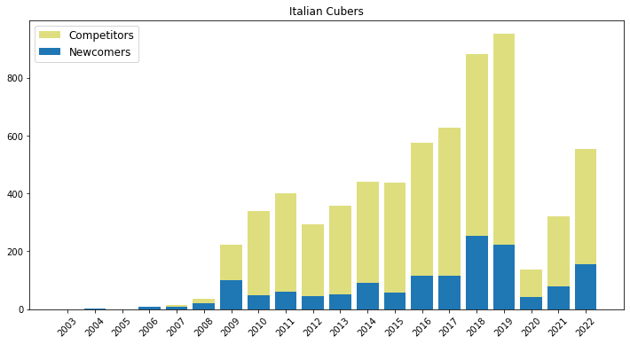
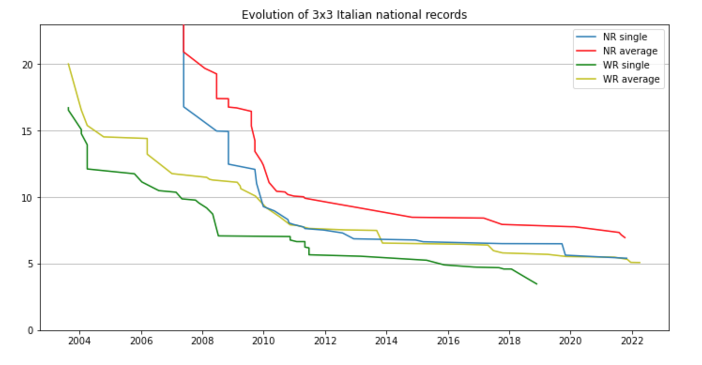
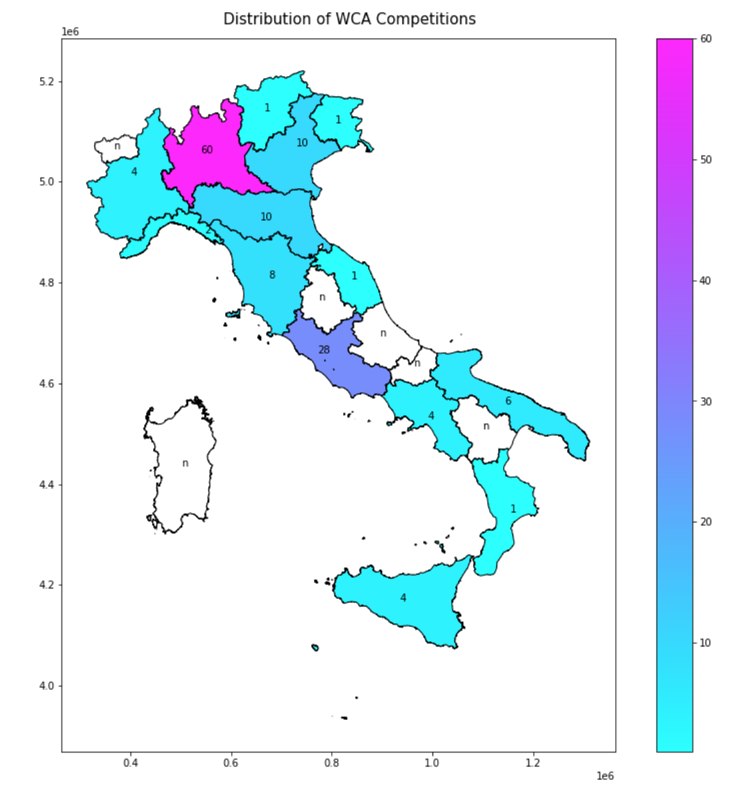
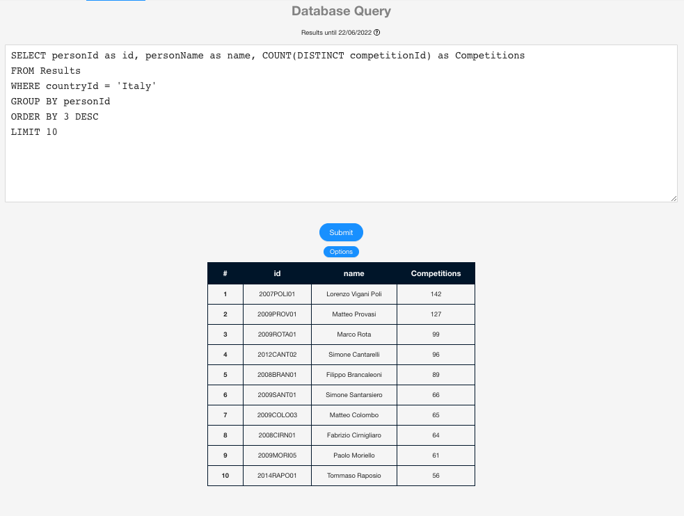

img{background-color:white}

# wca-statistics
A collection of statistics regarding WCA competitions

If you want to download the WCA database, you can find it [here](https://www.worldcubeassociation.org/results/misc/export.html).

## Python
In the Jupyter notebook you will find a collection of statistics with a focus on the Italian speedcubing community.

    
    
    

## SQL
If you own a WCA[^1] account, you can visit the [statistics.worldcubeassociation.org](https://statistics.worldcubeassociation.org/) website[^2] and either compute your own queries or use one of mine from this repository. 

- Log into the WCA account
- Go to the *Database Query* section
- Copy and paste the code from the desired query
- submit!

    

[^1]: [World Cube Association](https://www.worldcubeassociation.org/)
[^2]: Thank you [WCA Software Team](https://www.worldcubeassociation.org/teams-committees)!
