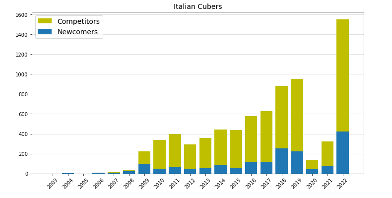
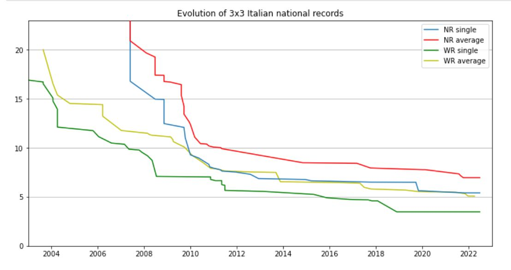
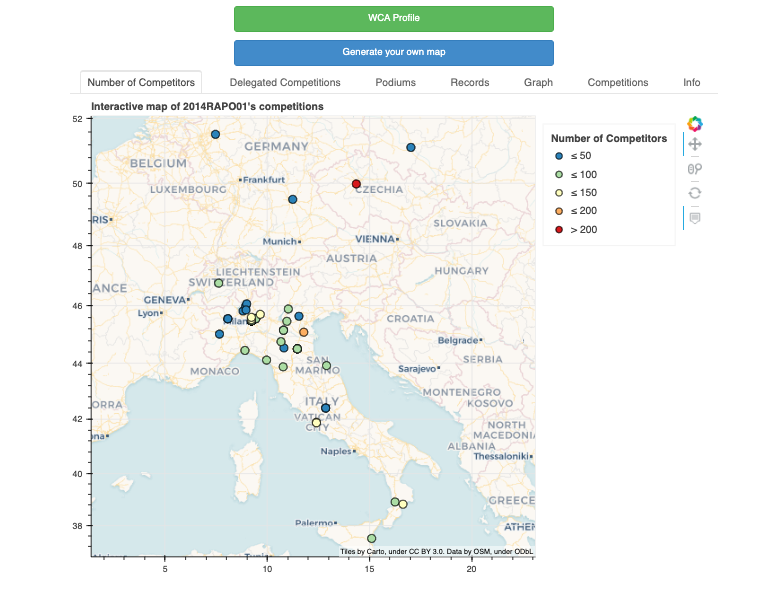

# wca-statistics
A collection of statistics regarding WCA competitions

## Speedsolving
The goal of <i>speedsolving</i> is to solve the Rubik's Cube (and similar puzzles) as fast as possible. Most speed solvers are able to do this in under 20 seconds and compete regularly against each other. I am a speed solver myself and a World Cube Association <i>Delegate</i> for Italy.

The World Cube Association (WCA)[^1] organizes and regulates speedsolving competitions all around the world, with the aim of providing more fun for more people under fair and equal conditions. All the official times achieved at competitions are posted on leaderboards and are publicly available at any time.

If you want to download the WCA database, you can find it [here](https://www.worldcubeassociation.org/results/misc/export.html).

## Python
In the Jupyter Notebooks you will find:
- A collection of statistics with a focus on the Italian speedcubing community. These are a few examples:

  
 

- A notebook that generates an interactive map of my WCA Competitions (with a few examples, 2003BRUC01 is by far the best one).

- A notebook that generates the longest (ongoing) streak of competitions with a personal record for each competitor.

## SQL
If you own a WCA account, you can visit the [statistics.worldcubeassociation.org](https://statistics.worldcubeassociation.org/) website[^2] and either compute your own queries or use one of mine from this repository. 

- Log into the WCA account
- Go to the *Database Query* section
- Copy and paste the code from the desired query
- submit!

  

[^1]: [World Cube Association](https://www.worldcubeassociation.org/)
[^2]: Thank you [WCA Software Team](https://www.worldcubeassociation.org/teams-committees)!
