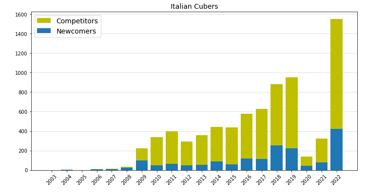
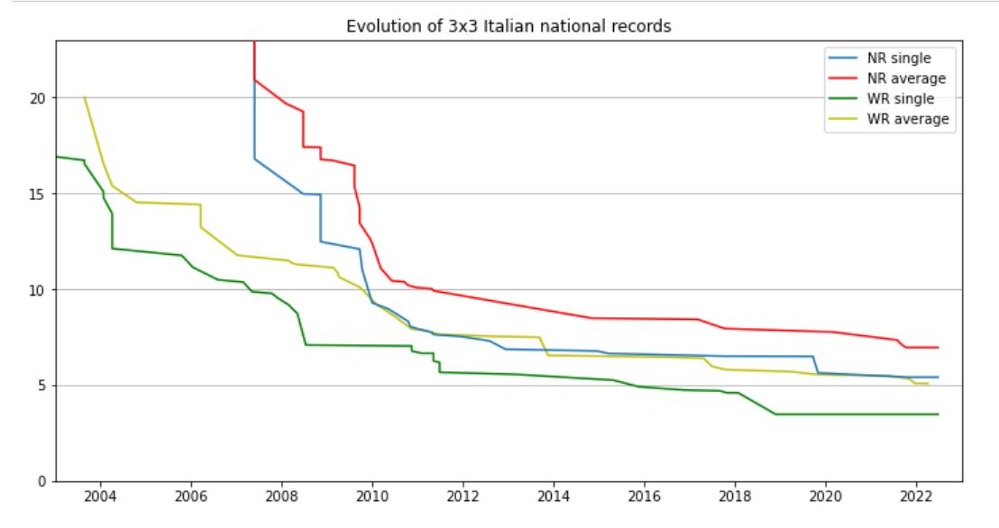
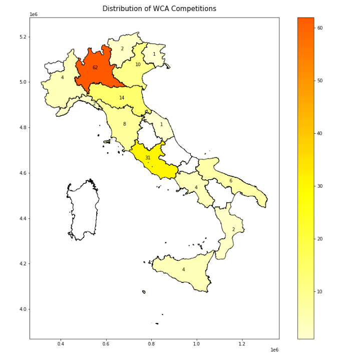
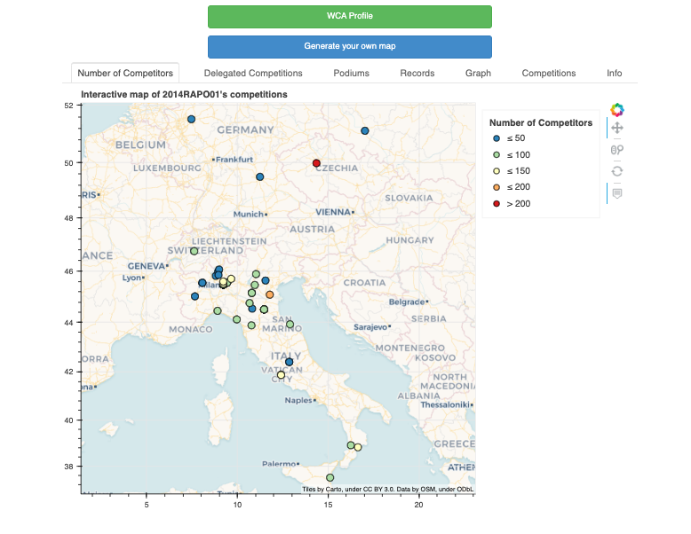

# wca-stats

A Python pipeline that ingests the official WCA (World Cube Association)
results database export and produces statistics on competitive cubers,
scoped to a configured country and nationality.

## Speedsolving

The goal of *speedsolving* is to solve the Rubik's Cube (and similar
puzzles) as fast as possible. Most speed solvers are able to do this in
under 20 seconds and compete regularly against each other. I am a speed
solver myself and a World Cube Association *Delegate* for Italy.

The World Cube Association (WCA)[^1] organizes and regulates
speedsolving competitions all around the world, with Purpose of empowering 
the global speedcubing community and upholding a fun and fair competitive 
environment for all. All the official times achieved at competitions are posted 
on leaderboards and are publicly available at any time.

If you want to download the WCA database, you can find it
[here](https://www.worldcubeassociation.org/export/results).

## Examples

A few of the statistics this pipeline produces, focused on the Italian
speedcubing community:

<!-- TODO: replace with curated plots from output/, stored in misc/ -->

<br><br>
<br>


## Setup

Two routes are supported. Pick one.

### Route A — conda (recommended for fresh environments)

```bash
conda env create -f environment.yml
conda activate wca-stats
pip install -e ".[dev]"
```

Conda is recommended because `geopandas` and its geo dependencies
install cleanly from `conda-forge`, sidestepping the system-library
headaches of `pip install geopandas`.

### Route B — pip in an existing environment

If you already have a Python ≥ 3.10 environment you want to use:

```bash
pip install -e ".[dev]"
```

This installs `wca-stats` in editable mode along with `pytest` and other
dev tools. You're responsible for ensuring `geopandas` works in your
environment.

### Running

From the repo root:

```bash
python -m wca_stats.main
```

For VS Code debugging setup and full pipeline details, see
[`docs/architecture.md`](docs/architecture.md).

For WCA-specific terminology used throughout the codebase, see
[`docs/domain-glossary.md`](docs/domain-glossary.md).

## Repository layout

```
wca-stats/
├── config.ini                # runtime config
├── pyproject.toml            # package identity + dependencies
├── environment.yml           # conda recipe
├── data/                     # WCA exports + auxiliary CSVs (gitignored)
├── output/                   # generated CSVs/figures (gitignored)
├── logs/                     # per-run logs (gitignored)
├── docs/                     # documentation
├── src/wca_stats/            # the package
│   ├── main.py               # pipeline entry point
│   ├── utils_wca.py          # shared utilities + constants
│   └── modules/              # one module per stats family
├── sql/                      # ad-hoc SQL probes (reference only)
└── tests/                    # pytest scaffold
```

---

[^1]: [World Cube Association](https://www.worldcubeassociation.org/)

Thank you to the [WCA Software Team](https://www.worldcubeassociation.org/teams-committees)
for maintaining the [statistics.worldcubeassociation.org](https://statistics.worldcubeassociation.org/)
service used for ad-hoc SQL queries against the live WCA database.

Thank you Claude for doing the rough work.